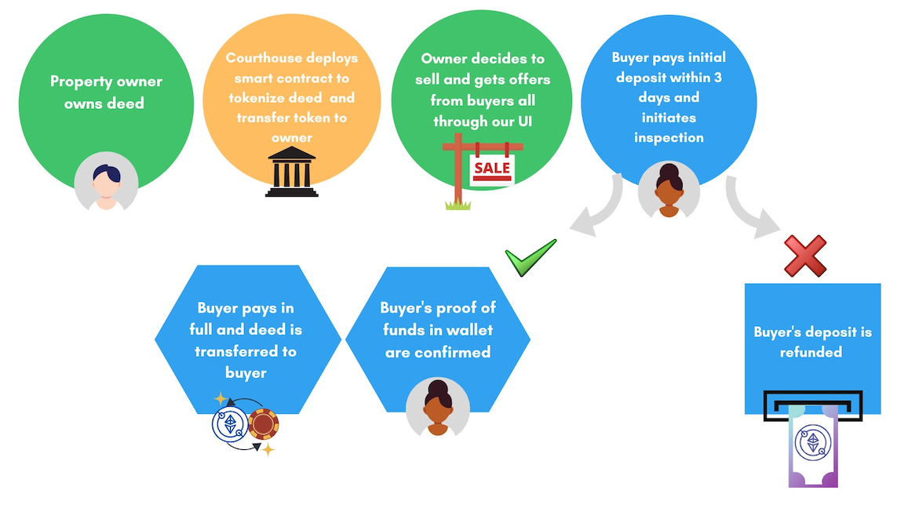

## Real Estate Transaction User Interface

The HTML, CSS, and JavaScript files in this repository have been developed as a user interface for a Solidity real estate smart contract. The smart contract concept is illustrated in the following flow chart:
 
 

 
 
There is an assumption that the local municipality has a system in place to tokenize each property in their jurisdiction which then allows smart contract deals to take place. The user interface would be located on the local municipality's server (or on the IPFS - InterPlanetary File System similar to the cloud) and would be accessible by the property owner and by the property buyer.

A self-guided demonstration is available at www.thecryptocrib.com. **Please note this is not a secure site, and sensitive information should not be entered into the provided fields.**

While all sub-pages have limited functionality, the Home page (*index.html*) is the only one that contains all of the project requirements. The following features have been included:

* Navigation menu that expands or stacks at various screen sizes (CSS)
* Grid used to layout items in the header. (CSS)
* Flexbox used to layout navigation bar and Ethereum smart contract link. (CSS)
* All pages have a field that displays the current date. (JavaScript)
* The Home and About pages have an array of popular cryptocurrencies with links. (JavaScript)
* The pages were built with a mobile-first design. There are two media queries - one for desktop screen sizes and one for tablet screen sizes - allowing for the header, navigation, and page format to adjust for the appropriate screen size.

### Next Steps:

1. Forms have been developed for the Seller and Buyer pages. These need to be styled and tested for validation and capturing information.
2. Research web3.js for the forms information to populate the Solidity smart contract. Code, test, and implement.
3. Add more content and functionality to all pages regarding the smart contract process. Show examples, provide tutorial and short practice exercises.
4. Continue to tighten up code in HTML, CSS, and JavaScript files.
5. Develop UI for real estate agents to use and market to them. These smart contracts will not replace their jobs. 

The market will evolve for these types of transactions. Focus on developing content and friendly UIs that will make an easy transition for people, businesses, and governments to use.